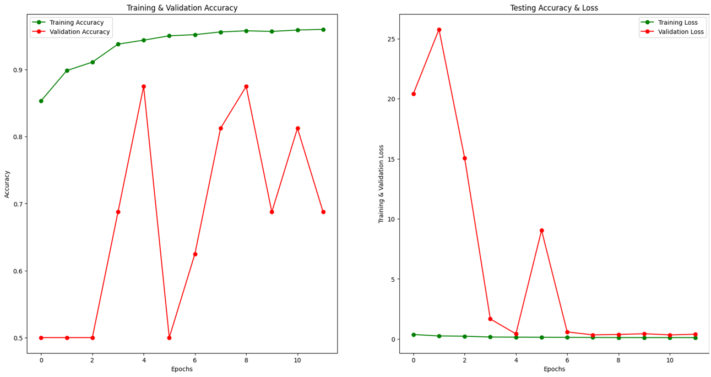
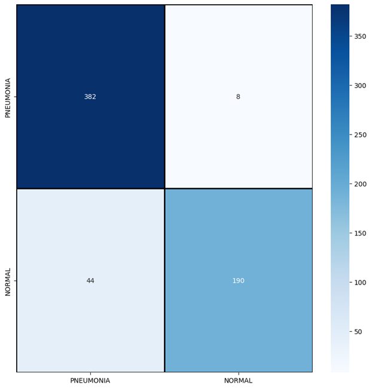

# Pneumonia-Detector

A CNN-based Pneumonia detection model built using TensorFlow and Keras, trained on Chest X-ray images. The project is executed on Google Colab and fetches the dataset directly via the Kaggle API. It also supports real-time predictions by allowing users to upload their own X-ray images.

---

## Model Evaluation Results
### Results

- Model Test Loss: 0.2261
- Model Test Accuracy: 91.67%
### Classification Metrics

- Accuracy: 91.99%
- Precision: 92%
- Recall: 92%
- F1-score: 92%

---
## Features

- Direct Kaggle dataset download via API using kagglehub
- Data preprocessing and augmentation
- CNN model with Batch Normalization, Dropout, and Pooling
- Training and validation with performance graphs
- Evaluation using classification report and confusion matrix
- Upload custom X-ray images for prediction (Pneumonia or Normal)

---

## Setup

1. **Clone this repository**:
   ```bash
   git clone https://github.com/your-username/Pneumonia-Detector.git
   ```
2. Open in Google Colab
3. Upload your kaggle.json (API credentials).
4. Train the model or load existing weights.
5. Upload your X-ray image and get the prediction!

   ---

## Dataset

- **Source:** [Kaggle - Chest X-Ray Images (Pneumonia)](https://www.kaggle.com/datasets/paultimothymooney/chest-xray-pneumonia)
---
